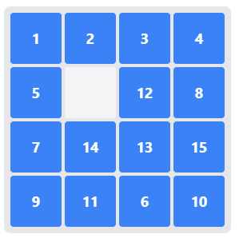

# Finding Your Way: How A* Search Makes Computers Smarter

Imagine you're in a maze, but instead of just wandering randomly, you have a device that tells you how far you are from the exit. That simple sense of distance - knowing if you're getting warmer or colder - transforms a blind search into an intelligent one. This is the essence of what makes A* search special, and I'll demonstrate it using one of the most elegant puzzle implementations: the 15 sliding tiles puzzle.

The 15-puzzle presents us with a 4x4 grid where fifteen numbered tiles can slide into an empty space. The goal is to arrange the numbers in order, from 1 to 15. While the rules are simple, finding the shortest solution is surprisingly complex. The puzzle's state space - the total number of possible arrangements - is a massive 16!/2 (about 10 trillion) configurations.



## The Blind Search: How Not to Solve a Puzzle

Let's start with how a computer algorithm might naively approach this problem. Imagine asking someone to solve the puzzle while blindfolded. They could try one of two strategies:

1. Breadth-First Search (BFS): Methodically try every possible sequence of moves, one step at a time. First all single moves, then all sequences of two moves, then three, and so on. Like exploring a maze by drawing a circle around your starting point and gradually expanding it.

2. Depth-First Search (DFS): Pick a sequence of moves and follow it as far as it goes (or to some pre-defined limit) before trying a different sequence. Like exploring a maze by always following the right wall until you hit a dead end (coincidentally, this is a pretty good strategy for mazes, but not for the 15 tiles puzzle).

Here's what these approaches look like in code:

```python
from collections import deque

def bfs_search(initial_state, goal_state, max_states=10000000):
    queue = deque([(initial_state, [initial_state])])
    visited = {initial_state}
    states_explored = 0
    
    while queue and states_explored < max_states:
        current_state, path = queue.popleft()
        states_explored += 1
        
        if current_state == goal_state:
            return path, states_explored
            
        for next_state in find_legal_moves(current_state):
            if next_state not in visited:
                visited.add(next_state)
                queue.append((next_state, path + [next_state]))
    
    return None, states_explored
```

And here's its depth-first counterpart, which dives deep into each possibility before backing up:

```python
def dfs_search(initial_state, goal_state, max_depth=50, max_states=10000000):
    stack = [(initial_state, [initial_state])]
    visited = {initial_state}
    states_explored = 0
    
    while stack and states_explored < max_states:
        current_state, path = stack.pop()
        current_depth = len(path) - 1
        states_explored += 1
        
        if current_state == goal_state:
            return path, states_explored
            
        if current_depth < max_depth:
            for next_state in find_legal_moves(current_state):
                if next_state not in visited:
                    visited.add(next_state)
                    stack.append((next_state, path + [next_state]))

    return None, states_explored
```

Notice how we need a `max_depth` parameter here - without it, DFS might disappear down an endless rabbit hole of moves that take us further and further from the solution. It's like our blindfolded solver deciding to keep turning right at every opportunity, potentially walking in circles forever.

These approaches work... technically. But for solving the 15 tiles puzzle they are inefficient. They have no sense of whether a move brings them closer to or further from the solution. Let's look at some numbers for a simple puzzle state:

```python
initial_state = [1, 3, 2, 0,
                 5, 6, 4, 8,
                 9, 10, 7, 11,
                 13, 14, 15, 12]

goal_state = [1, 2, 3, 4,
              5, 6, 7, 8,
              9, 10, 11, 12,
              13, 14, 15, 0]

path, states_explored = bfs_search(initial_state, goal_state)
if path:
    print(f"BFS: solution found after exploring {states_explored} states")
else:
    print("BFS: No solution found")

path, states_explored = dfs_search(initial_state, goal_state)
if path:
    print(f"DFS: solution found after exploring {states_explored} states")
else:
    print("DFS: No solution found")
```

Output:

```
BFS: Solution found after exploring 1064625 states
DFS: No solution found
```

BFS explores a million states before finding a solution. DFS might get lucky, but in this instance no solution was found, even after exploring 10 million states. We need something smarter.

## A* Search: Adding a Distance to Our Search

Enter A* search. Instead of blindly exploring states, A* uses a clever formula to prioritize which states to explore next:

f(n) = g(n) + h(n)

Where:
- g(n) is the cost so far (how many moves we've made)
- h(n) is our rough estimate of how many more moves we need to reach a solution
- f(n) is our total estimated cost


The key insight is in how we prioritize which states to explore. Instead of the simple queue of BFS or stack of DFS, we use a priority queue ordered by f_score. States that appear promising (low f_score) get explored first, while states that seem costly or far from the goal wait their turn.

Here's how this translates into code:

```python
from heapq import heappush, heappop

def astar_search(initial_state, goal_state, max_states=10000000):
    """
    A* search using Manhattan distance heuristic.
    """
    initial_state = tuple(initial_state)
    goal_state = tuple(goal_state)
    
    # Priority queue of (f_score, g_score, state, path)
    # f_score = g_score + h_score (path cost + heuristic)
    queue = [(calculate_manhattan_distance(initial_state, goal_state), 
             0, initial_state, [initial_state])]
    
    # Keep track of best g_score for each state
    g_scores = {initial_state: 0}
    states_explored = 0
    
    while queue and states_explored < max_states:
        f_score, g_score, current_state, path = heappop(queue)
        states_explored += 1
        
        if current_state == goal_state:
            return path, states_explored
            
        # Generate successor states
        for next_state in find_legal_moves(list(current_state)):
            next_state = tuple(next_state)
            new_g_score = g_score + 1  # Cost of 1 to move to any adjacent state
            
            # If we haven't seen this state or found a better path to it
            if next_state not in g_scores or new_g_score < g_scores[next_state]:
                g_scores[next_state] = new_g_score
                h_score = calculate_manhattan_distance(next_state, goal_state)
                f_score = new_g_score + h_score
                heappush(queue, (f_score, new_g_score, next_state, 
                               path + [next_state]))
    
    return None, states_explored
```

In this implementation Python's `heapq` module is used to maintain a priority queue of states. The priority queue is a min-heap, so the smallest f_score is at the top. The `heappop` function removes and returns the smallest element from the heap.

Notice also how we keep track of the best g_score for each state we've seen. If we find a better path to a state we've already visited, we're happy to reconsider it. This is different from our blind searches where we simply marked states as visited and never looked back.

A* is like having a device that not only tells us how far away the goal is, but also considers how far we've already traveled. But the magic - and challenge - lies in that h(n) function. How *do* we estimate how far we are from the solution?

## The Manhattan Distance: A First Step Toward Intelligence

Before diving into our h(n) heuristic, let's establish a critical rule: for A* to find optimal (shortest) solutions, our distance estimate must never overestimate the true distance to the goal. It can be exact or underestimate, but overestimation risks leading to solutions that are not optimal. This property is called "admissibility" in search theory.

At one extreme, we could use a heuristic that always returns 0 - it's admissible (never overestimates) but totally uninformative. With this, A* degenerates into regular BFS, blindly expanding in all directions. At the other extreme, if we somehow had a perfect heuristic that always knew the exact number of moves needed, A* would march straight to the solution without exploring any unnecessary states. The art lies in finding a heuristic between these extremes - one that's both admissible and informative.

The simplest useful heuristic for the 15-puzzle is the Manhattan distance. For each tile, we count how many steps it needs to move horizontally and vertically to reach its goal position. Sum these up for all tiles, and we have a lower bound on how many moves we need.

Here's the code for our heuristic:

```python
def calculate_manhattan_distance(state, goal_state):
    size = 4
    return sum(
        abs(i//size - goal_state.index(tile)//size) + 
        abs(i%size - goal_state.index(tile)%size)
        for i, tile in enumerate(state) if tile != 0
    )
```

But we can do even better. Consider this situation:
```
Current:  Goal:
1 3 2     1 2 3
```
The Manhattan distance sees this as requiring 2 moves (2 needs to move one step left, 3 needs to move one step right). But we actually need at least 3 moves because the tiles need to slide past each other. This is called a "linear conflict."

Adding this insight to our heuristic:

```python
def count_conflicts(tiles):
    return 2 * sum(1 for (p1, t1), (p2, t2) in combinations(tiles, 2)
                  if p1 < p2 and t1 > t2)
```

The results are dramatic. Let's compare the number of states explored:

- BFS: 1,064,625 states
- DFS: No solution
- A* with Manhattan: 1,286 states
- A* with Manhattan + Linear Conflicts: 511 states

This is the power of having a good heuristic. Just like a compass transforms wandering into directed navigation, a good heuristic transforms blind search into intelligent problem-solving.

## Beyond Puzzles: Why This Matters

The principle we've explored - that having even a rough estimate of distance to your goal can dramatically improve search efficiency - extends far beyond puzzle solving. This same concept powers:

- GPS navigation finding the fastest route
- Video game characters pathfinding around obstacles
- Robots planning movements
- Network routing algorithms

The key insight is that we don't need perfect information to make intelligent decisions. We just need a reasonable estimate that points us in the right direction. In an age where we're increasingly relying on algorithms to solve complex problems, understanding how to guide these searches effectively becomes ever more crucial.

The complete code for this exploration, including a simple bidirectional A* implementation, is available in the accompanying repository. Feel free to experiment with different heuristics and puzzle states - you might be surprised at how much impact a small improvement in the heuristic can have on solving efficiency.

Remember: in problem solving, you don't need to know exactly how to reach your goal - you just need to know if you're getting warmer or colder.


## Installation and Running the Code

1. First, ensure you have [Conda](https://docs.conda.io/en/latest/) installed on your system.

2. Clone this repository:
   ```bash
   git clone https://github.com/mengqvist/a_star.git
   cd a_star
   ```

3. Create and activate the Conda environment:
   ```bash
   conda env create -f environment.yml
   conda activate astar
   ```

4. Run the code:
   ```bash
   python sliding_puzzle.py
   ```

The visualization will show each step of the solution path.
